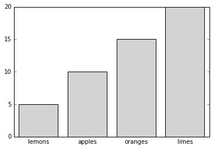

Catagorical data, like most data, often really needs to be visualized for readability. 
A standard method to visualizae catagorical information is via a bar chart, such as the following:

And even a graph this simple requires the user to unpack a native data structure\
 in order to create it:

<pre><code>data = {'apples':10, 'oranges':15, 'lemons':5, 'limes':20}
fig = plt.figure()`
ax = fig.add_subplot(1,1,1)`
ax.bar(range(4), data.values(), tick_label=data.keys(),
       align='center', color='lightgray')
ax.xaxis.set_tick_params(size=0)
</code></pre>

One of the major aims of this project is to simplify the process so that at the \
least, the ax.bar call can be reduced to something like <code>ax.bar(data.keys(), d\
ata.values(), align='center', color='lightgray')</code>

This project aims to encompass more than just bar graphs, and more than just dic\
tionaries; support charts and data structures will determined as the project develo\
ps. 

      </section>
    

